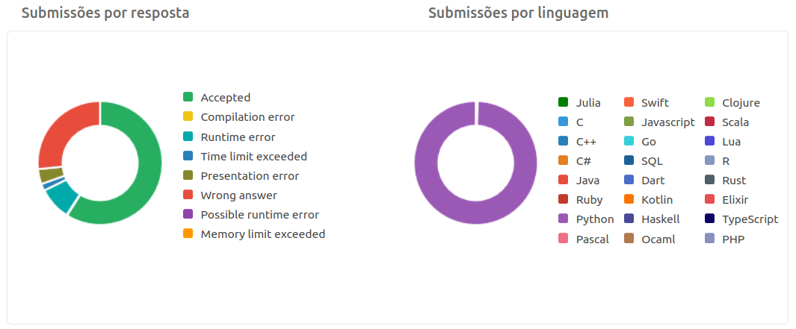
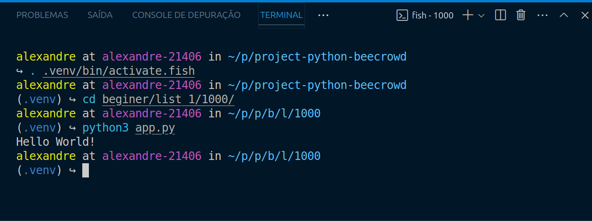

# Boas-vindas

## Sobre o repositório

Este repositório tem como objetivo o desenvolvimento de soluções de questões da plataforma [Beecrowd](https://judge.beecrowd.com/pt/login) utilizando conceitos de lógica de programação, com foco na linguagem Python, que atualmente é o meu foco de estudo. Além disso, poder ajudar iniciantes no aprendizado em programação.

## Avisos importantes

Serão disponibilizadas apenas as questões da categoria Iniciante da plataforma, as questões das demais categorias poderão ser resolvidas futuramente, mediante a minha disponibilidade.

Todas as submissões na plataforma foram realizadas entre as datas **14/05/2024** e **23/06/2024**.

Nós códigos em que consulta ou utilização de trechos de códigos, deixarei nos respectivos códigos os comentários fazendo as devidas referências.

## Ambiente de desenvolvimento

- Sistema operacional: [Ubuntu 24.04 lts](https://ubuntu.com/download/desktop)
- Linguagem de programação: [Python 3.12.3](https://www.python.org/downloads/release/python-3123/)
- Editor de texto: [Visual Studio Code](https://code.visualstudio.com/download)
- Terminal: [Fish](https://fishshell.com/)
- Prompt de linha de comando: [Starship](https://starship.rs/)
- Extensão para a formatação do código Python: [Ruff](https://astral.sh/ruff)

## Conceitos utilizados

- Lógica de programação
- Tipos de variáveis
- Estruturas condicionais
- Estruturas de repetição
- Expressões lambda
- Estruturas de dados ( vetores, matrizes, dicionários, tuplas )
- Funções

## Questões não solucionadas

| Questões                             | Status |
| ------------------------------------ | ------ |
| 3181 - Jantar                        | :x:    |
| 3229 - Resenhas de comida            | :x:    |
| 3230 - Senhores de Guerra Galácticos | :x:    |
| 3231 - Horror List                   | :x:    |
| 3232 - Infiltration                  | :x:    |
| 3233 - Suco                          | :x:    |
| 3234 - Kindergarten                  | :x:    |
| 3235 - Luggage                       | :x:    |
| 3250 - Problema no elevador          | :x:    |
| 3252 - Reus da Floresta              | :x:    |
| 3253 - Problemas com o Carro         | :x:    |
| 3255 - A vez do Primo                | :x:    |
| 3256 - Divisão Inimiga               | :x:    |
| 3258 - Fervendo Vegetais             | :x:    |
| 3267 - Passeio no Penhasco           | :x:    |
| 3306 - Consulta e Alteração          | :x:    |
| 3343 - Attack on Gasparini           | :x:    |

## Estatísticas de submissões

## Execução do projeto

Para executar os códigos deve-se executar os passos a seguir:

1. Crie um ambiente virtual, caso tenha o interesse em instalar dependências externas.

   `python3 -m venv .venv`

   ou

   `python -m venv .venv`

2. Ative o ambiente virtual.

   Caso esteja utilizando o fish terminal utilize este comando.

   `. .venv/bin/activate.fish`

   ou

   `. .venv/bin/activate`

3. Instale a dependência desejada.

   `pip install nome_da_dependência`

4. Para gerar o arquivo com as dependências instaladas.

   `pip freeze > requirements.txt`

5. Acesse o diretório do script que deseja executar.

   `cd beginer/list_1/1000`

   `cd beginer/list_1/1001`

   `cd beginer/list_1/1002`

6. Execute o script.

   `python3 app.py`

   ou

   `python app.py`

## Exemplo de execução

